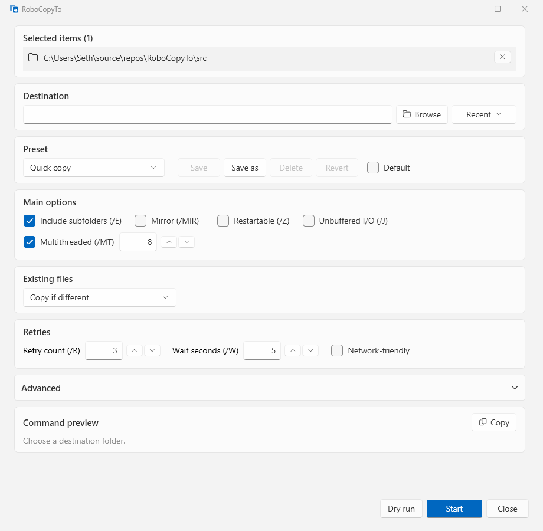

# RoboCopyTo: A Safer, Smarter Robocopy GUI for Windows 11

**RoboCopyTo** is a free Windows 11 file copy tool that adds a **RoboCopyTo...** item to the Explorer right-click menu. It opens one dialog where you build, preview, dry-run, and run `robocopy` copies, so you never have to remember robocopy syntax and you always see the exact command that will run. Use it as a context menu copy utility, a safe robocopy wrapper, or a simple backup tool for Windows.

## Quick start

1. [Download the latest release](https://github.com/sethdtwigg/RoboCopyTo/releases/latest) and extract the zip.
2. Double-click `RoboCopyTo.exe` and answer **Yes** to install. No admin rights needed.
3. Right-click any file or folder → **Show more options → RoboCopyTo...**

If SmartScreen says "Windows protected your PC", choose **More info → Run anyway** (the exe is not code-signed). Requires Windows 11 (x64); Windows 10 may work but is untested.

## Features

- **Live command preview**: the exact `robocopy` command updates as you click, and you can copy it.
- **Dry run**: see what would be copied or removed (`/L`) before touching anything.
- **Presets**: Quick copy, Mirror backup, and Large files over network built in; save your own.
- **Multi-select that works**: select any mix of files and folders (even more than 15) and each lands in the right place.
- **Safety checks**: blocks copies into themselves and mirrors that would delete your source.
- **Progress and results**: live progress against a pre-scanned total, **Cancel**, a plain-language results screen, and **Open log**.
- **Retry failed**: rerun only what is left; robocopy skips files already copied.
- **Recent destinations**: your last 10 destinations are one click away.
- **Elevation handled for you**: options that need admin show a shield and relaunch through UAC, with mapped drives converted to UNC paths.
- **Per-user and clean**: installs and uninstalls without admin rights and writes only to documented locations.

## Why use RoboCopyTo instead of raw robocopy?

Robocopy is powerful but unforgiving. A wrong switch can delete data, and the syntax is easy to get wrong.

| Raw robocopy | RoboCopyTo |
|---|---|
| Memorize `/E /MIR /Z /MT /XF /XD /R /W ...` | Tick options with plain-language labels |
| Folder copies need the folder name appended to the destination by hand | Done for you, per selected folder |
| `/MIR` into the wrong folder silently deletes files | Blocked, or confirmed with the exact folders listed |
| Quoting paths with spaces, trailing backslashes, and drive roots | Quoted correctly, verified against real robocopy and tests |
| Exit codes like `3` or `9` | "Files copied; destination has extra items" |
| Elevated runs lose your mapped drives | Mapped drives are converted to UNC for the elevated run |
| No way to preview | Live command preview and dry run |
| Scripts for each backup job | Presets |

Compared with a PowerShell script or a batch file, there is nothing to maintain, and every run is logged.

## Use cases

- Copy a folder to a USB drive or network share, with retries and resume for flaky connections.
- Run a Mirror backup of a project folder to an external drive, safely.
- Copy a mixed selection of files and folders from different places to one destination.
- Preview a risky copy with a dry run before running it for real.

## Safety features

RoboCopyTo checks every Start and Dry run. Among other things it **blocks**: a destination inside a selected source, a copy onto itself, `/MIR` or `/PURGE` with loose files selected, and a mirror whose target contains the source. It **asks first** when you use `/MIR`, `/PURGE`, or `/MOVE`, and **warns** about low free space. Full table: [Safety checks](docs/USAGE.md#safety-checks-run-on-start-and-dry-run).

## Documentation

- [Installation, uninstalling, command-line switches, and what the app writes](docs/INSTALL.md)
- [Using the dialog, presets, safety checks, elevation, and every robocopy switch emitted](docs/USAGE.md)
- [Building, testing, and publishing](docs/BUILDING.md)

## Command-line options

| Switch | Effect |
|---|---|
| `--register` / `--unregister` | Add or remove the context-menu entry (current user only) |
| `--status` | Show whether the entry exists and where it points |
| `<path>` | Open the dialog for that file or folder |

Details in [docs/INSTALL.md](docs/INSTALL.md#command-line-switches).

## Troubleshooting

- **SmartScreen blocks the first launch**: choose **More info → Run anyway**. The installer then removes the "downloaded from the internet" mark from the installed copy.
- **I don't see the menu item**: on Windows 11 it is under **Show more options**. Run `RoboCopyTo.exe --status` to check registration.
- **Admin options show a shield**: Copy owner, Copy auditing info, Backup mode, and `/ZB` need elevation. Accept the UAC prompt; if you decline, the dialog stays open.
- **Mapped drives and UNC paths**: elevated processes usually cannot see mapped drives, so RoboCopyTo converts them to UNC paths for elevated runs.
- **Moved the folder**: run `RoboCopyTo.exe --register` again from the new location, and keep the exe together with its five DLLs.
- **Logs**: every run writes a log under `%LocalAppData%\RoboCopyTo\Logs\` (kept 30 days); use **Open log** on the results screen.

## Design philosophy

- **Show, don't hide**: the exact command is always visible, so the tool teaches robocopy instead of replacing your understanding of it.
- **Safe by default**: destructive combinations are blocked or confirmed, and dry run is one click away.
- **Small footprint**: per-user install, no admin rights, HKCU-only registration, and a documented list of everything written.
- **Tested against the real thing**: path quoting and output parsing are covered by tests that run the real `robocopy.exe`.

## Changelog

See [CHANGELOG.md](CHANGELOG.md) and the [releases page](https://github.com/sethdtwigg/RoboCopyTo/releases).

## License

MIT License. Copyright (c) 2026 Seth Twigg. See [LICENSE](LICENSE).
